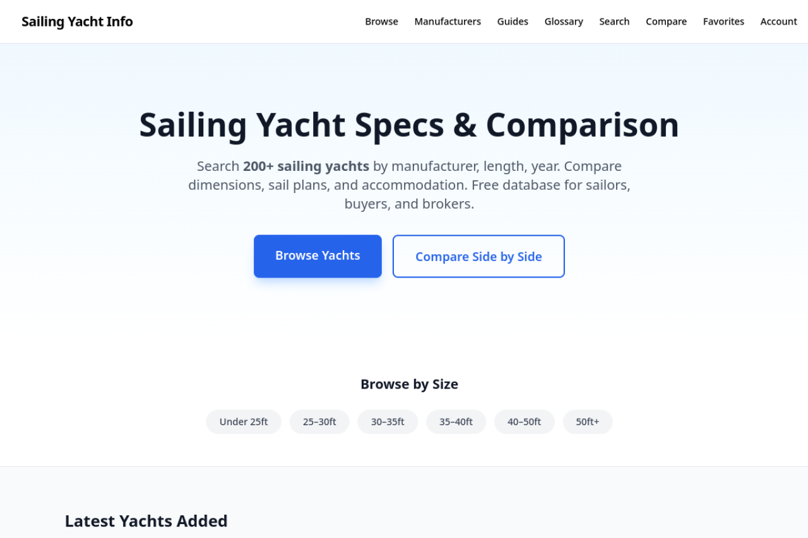

# Sailing Yachts Database



A comprehensive, searchable database of sailing yacht specifications with comparison tools, reviews, buying guides, and programmatic SEO landing pages. Built for the French and English sailing markets.

**Live site:** [info.sailboats.fr](https://info.sailboats.fr)

## Features

### Core
- Browse 240+ yachts with dynamic filters (length, rig type, keel type, hull material, cabins, etc.)
- Full-text search across yacht models, manufacturers, and specs
- Side-by-side comparison of up to 3 yachts with radar charts and spec bars
- Detailed yacht pages with quick facts, spec tooltips, media gallery, and video embeds
- Admin dashboard for full CRUD operations on yachts, manufacturers, and content

### Discovery & Recommendations
- **Yacht Finder Wizard** — 7-step guided quiz matching users to ideal yachts
- **Smart Recommendations** — "Yachts like this" based on similarity scoring
- **Use-case landing pages** — Bluewater cruising, racing, family cruising, etc.
- **Size category hubs** — Under 30ft, 30-35ft, 35-40ft, 40-45ft, 45-50ft, over 50ft
- **Manufacturer + size pages** — e.g., `/yachts/beneteau/40ft`
- **Saved searches & alerts** — Users can save search criteria for notifications

### Content & SEO
- **Programmatic SEO pages** — 500+ landing pages for manufacturer × size × use-case combinations
- **Sailing guides CMS** — Rich content editor with Markdown, image uploads, SEO fields
- **Auto-generated FAQ** — Dynamic FAQs from yacht data patterns with schema markup
- **Buying guides** — Editorial "Best [year] [size] sailboats" pages
- **Glossary** — Sailing terminology with tooltips on spec values
- **Multilingual content pipeline** — Auto-translation to French with human review queue
- **Sitemap suite** — 7 specialized XML sitemaps (yachts, manufacturers, programmatic, FAQ, guides, images, pages)

### Social & Engagement
- **5-star rating system** — User ratings with distribution charts and JSON-LD AggregateRating
- **Review aggregation** — External review sources with admin moderation
- **Comparison sharing** — Persistent shareable comparison URLs with OG images
- **Email a yacht** — Send yacht details to a friend
- **Embeddable widget** — Third-party embeddable comparison tool (iframe + postMessage)
- **Yacht of the Week** — Admin-configurable featured yacht on homepage

### Monetization
- **Premium manufacturer listings** — Enhanced profiles with video, documents, verified badge
- **Lead scoring & qualification** — Behavior-based lead scoring with priority routing
- **Affiliate optimization** — A/B tested affiliate link placement and rotation
- **Premium PDF reports** — Lead-gated branded comparison PDFs
- **Newsletter monetization** — Campaign builder with sponsored slots and subscriber segmentation

### Analytics & Intelligence
- **User behavior dashboard** — Page views, popular yachts, search trends, comparison patterns
- **A/B testing framework** — Experiment management with statistical significance calculator
- **Conversion funnel tracking** — Landing → search → detail → compare → lead journey
- **Search intent analysis** — Zero-result searches, popular filters, content gap detection
- **Competitive positioning** — Auto-generated manufacturer comparison matrix

### Technical Excellence
- **Edge Runtime** — Public API routes run on Vercel Edge for ~10x faster cold starts
- **ISR with cache tags** — 1-hour revalidation with granular invalidation
- **Image optimization** — Next.js Image with AVIF/WebP, blur placeholders
- **Code splitting** — Lazy-loaded below-the-fold components (21% bundle reduction on /compare)
- **Core Web Vitals monitoring** — Real-time CWV dashboard with Sentry integration
- **Zod validation** — Input validation on all POST/PUT/DELETE API routes
- **Loading skeletons** — 14 route-level skeleton components matching actual page layout
- **Error boundaries** — 14 route-level error boundaries with retry functionality

## Tech Stack

| Layer | Technology |
|-------|-----------|
| Framework | Next.js 14 (App Router, RSC) |
| Language | TypeScript (strict mode) |
| Database | PostgreSQL (Neon serverless) |
| ORM | Drizzle ORM |
| Styling | Tailwind CSS + shadcn/ui |
| i18n | next-intl (EN/FR) |
| Auth | NextAuth.js |
| Charts | Recharts |
| PDF | pdf-lib |
| Testing | Playwright (E2E + integration), Vitest (Storybook) |
| Monitoring | Sentry |
| Deployment | Vercel (Edge + Node.js runtimes) |
| CI/CD | GitHub Actions (CI, CodeQL, Dependabot, Lighthouse CI) |

## Quick Start

### Prerequisites

- Node.js 18+ (recommend 20+)
- A PostgreSQL database (we recommend [Neon](https://neon.tech))

### Setup

```bash
git clone https://github.com/pgedeon/sailing-yachts.git
cd sailing-yachts
npm install

# Configure environment
cp .env.example .env.local
# Edit .env.local: DATABASE_URL, ADMIN_API_KEY, NEXT_PUBLIC_APP_URL

# Run migrations
npx drizzle-kit migrate

# Seed sample data (optional)
npm run seed

# Start dev server
npm run dev
```

Open [http://localhost:3000](http://localhost:3000).

### Environment Variables

| Variable | Required | Description |
|----------|----------|-------------|
| `DATABASE_URL` | ✅ | PostgreSQL connection string (Neon pooled endpoint) |
| `ADMIN_API_KEY` | ✅ | Secret key for admin API |
| `NEXT_PUBLIC_APP_URL` | ✅ | Public URL |
| `NEXTAUTH_SECRET` | Auth | Session encryption key |
| `NEXTAUTH_URL` | Auth | Auth callback URL |
| `SENTRY_DSN` | Optional | Error monitoring |
| `RESEND_API_KEY` | Optional | Transactional email |

See [`.env.example`](.env.example) for all variables.

## Documentation

| Resource | Description |
|----------|-------------|
| [API Documentation](docs/API.md) | All public, internal, and admin API endpoints |
| [Contributing Guide](CONTRIBUTING.md) | Setup, coding standards, PR process |
| [Architecture Decisions](docs/adr/) | ADRs for key technical choices |
| [API Docs (interactive)](https://info.sailboats.fr/api/docs) | OpenAPI 3.0 spec with examples |
| [OpenAPI JSON](https://info.sailboats.fr/api/v1/openapi) | Machine-readable spec |

## Project Structure

```
sailing-yachts/
├── app/
│   ├── [locale]/            # Localized pages (EN/FR)
│   │   ├── yachts/          # Browse, detail, by-size, use-case pages
│   │   ├── compare/         # Yacht comparison
│   │   ├── manufacturers/   # Manufacturer listings & detail
│   │   ├── guides/          # Sailing guides
│   │   ├── quiz/            # Yacht finder quiz
│   │   ├── search/          # Full-text search
│   │   ├── favorites/       # User favorites
│   │   └── ...
│   ├── admin/               # Admin dashboard (EN-only)
│   ├── api/                 # 130+ API routes (public, admin, cron)
│   ├── embed/               # Embeddable widget configurator
│   └── auth/                # Auth pages
├── components/              # 30+ shared React components
│   ├── ui/                  # shadcn/ui primitives (button, input, skeleton, etc.)
│   └── *.stories.tsx        # Storybook stories
├── lib/                     # 80+ service modules
├── drizzle/                 # DB schema & migrations
├── messages/                # i18n catalogs (en.json, fr.json)
├── tests/                   # Playwright E2E + integration tests
├── docs/                    # API docs, ADRs
├── .storybook/              # Storybook configuration
└── public/                  # Static assets, sitemaps
```

## Database Schema

The schema uses a hybrid approach: core specs as columns, everything else as dynamic key-value pairs.

| Table | Description |
|-------|-------------|
| `manufacturers` | Yacht manufacturers with premium tier fields |
| `yacht_models` | Core yacht specs (20+ indexed columns) |
| `spec_categories` | Dictionary of spec types (extensible without code changes) |
| `spec_values` | Dynamic spec values per yacht (numeric/text/boolean) |
| `images` | Yacht images with type classification |
| `reviews` | User-submitted and imported reviews |
| `review_sources` | External review source configurations |
| `articles` | Sailing guides and editorial content |
| `content_translations` | Translation queue with review status |
| `translation_memory` | Translation memory for consistency |
| `ab_experiments` | A/B test experiments |
| `ab_events` | A/B test event tracking |
| `newsletter_subscribers` | Newsletter subscriber management |
| `newsletter_campaigns` | Email campaign builder |
| `leads` | Inquiry leads with scoring |
| `search_intents` | Search analytics and zero-result tracking |
| `web_vitals` | Core Web Vitals metrics |
| `alert_preferences` | User alert settings |
| `saved_comparisons` | Shared comparison configurations |
| `faq_proposals` | Auto-generated FAQ entries |
| `audit_logs` | Admin action audit trail |

See [ADR 0003](docs/adr/0003-dynamic-spec-schema.md) for the schema design rationale.

## API Overview

- **Public API v1** (`/api/v1/`): Versioned, stable endpoints for yacht data — [docs](docs/API.md)
- **Internal API** (`/api/`): Powers the web UI, may change without notice
- **Admin API** (`/api/admin/`): Protected by Bearer token
- **OpenAPI spec**: [`/api/v1/openapi`](https://info.sailboats.fr/api/v1/openapi)

## Storybook

Component development environment with isolated stories:

```bash
npm run storybook          # Dev server on port 6006
npm run build-storybook    # Static build for deployment
```

Stories are in `components/*.stories.tsx`. Covers StarRatingDisplay, RatingDistribution, QuickFacts, SocialShareButtons, Skeletons, and Button.

## Testing

```bash
npx playwright test                # All E2E + integration tests
npx playwright test tests/api/     # API integration tests only
npx playwright test tests/e2e/     # Critical journey tests only
```

Test coverage includes:
- 55+ API integration tests (all public GET endpoints + error handling)
- 25+ error handling tests
- 20+ E2E critical journey tests (desktop + mobile)

## Deployment

The site auto-deploys to Vercel on merge to `main`.

| Environment | URL | Branch |
|-------------|-----|--------|
| Production | `info.sailboats.fr` | `main` |
| Preview | Vercel auto-generated | PR branches |

Build: ~10 minutes (1500+ static pages generated).

## Roadmap

See [FUTURE_ROADMAP.md](FUTURE_ROADMAP.md) for the full phase-by-phase development plan.

**Current status:** Phases 0-26 complete. Phase 27 (Technical Debt & Platform Hardening) in progress.

## Contributing

Pull requests welcome! See [CONTRIBUTING.md](CONTRIBUTING.md) for setup, coding standards, and PR process.

## License

Custom Non-Commercial License — free for individuals and organizations with under $100k/year gross revenue. See [LICENSE](LICENSE) for details.

---

[](https://www.paypal.com/donate/?business=petermgedeon%40gmail.com)
